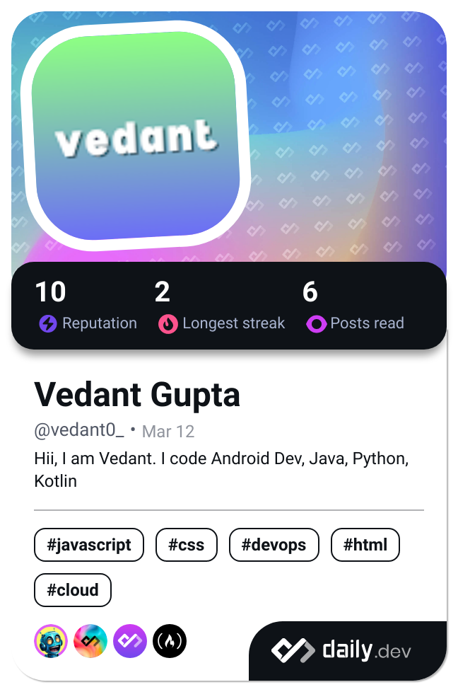

# Hi, I'm Vedant 👋
I'm am an Android Developer, who is always looking to learn something new, something innovative!

## I can code (obviously) 🛠
#### Languages 🔠
* Java
* Kotlin
* Python

## Current Status ⌚
👩‍💻 I'm currently working on [MelonFeed](https://instagram.com/melon.feed)

🤔 I'm looking for help with Android Development

📫 How to reach me
* Discord: vedant0_

## More about me 📚
😄 Pronouns: He/Him

⚡️ Fun fact: I code

## 🔗 Links

